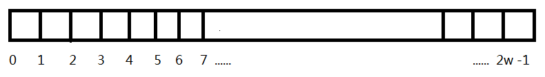
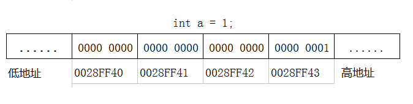
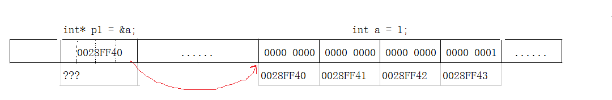
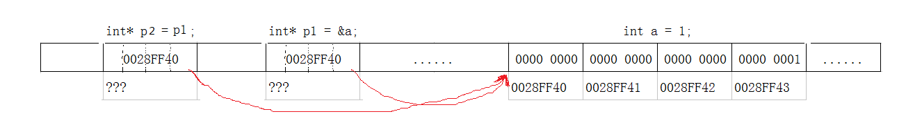
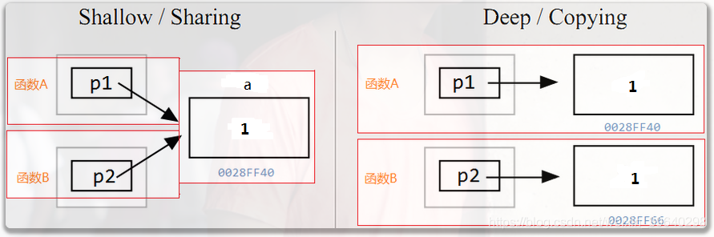

# 指针

## 导入

在函数的课程中，我们已经初步接触了“引用”的概念，在变量a前面加入&符号，可以获得a在内存中的地址，将地址传入到自定义的函数中，对地址对应的变量进行操作，即可改变传入的实参的值。*内存中的地址*看起来是这个样子的：
```cpp
#include <iostream>
 
using namespace std;
 
int main ()
{
   int  var1;
   char var2[10];
 
   cout << "var1 变量的地址： ";
   cout << &var1 << endl;
 
   cout << "var2 变量的地址： ";
   cout << &var2 << endl;
 
   return 0;
}
```
输出

    var1 变量的地址： 0xbfebd5c0
    var2 变量的地址： 0xbfebd5b6

显然，像0xbfebd5c0这样的数据，我们无法用以前学习过的任意一种变量类型进行保存。对于内存地址这样的数据，需要使用指针变量去访问。

指针是“指向（point to）”另外一种类型的复合类型。复合类型是指基于其它类型定义的类型。

理解指针，先从内存说起：内存是一个很大的，线性的字节数组。每一个字节都是固定的大小，由8个二进制位组成。最关键的是，每一个字节都有一个唯一的编号,编号从0开始，一直到最后一个字节。

程序加载到内存中后，在程序中使用的变量、常量、函数等数据，都有自己唯一的一个编号，这个编号就是这个数据的地址。

指针的值实质是内存单元（即字节）的编号，所以指针单独从数值上看，也是整数，他们一般用16进制表示。指针的值（虚拟地址值）使用一个机器字的大小来存储,也就是说,对于一个机器字为w位的电脑而言,它的虚拟地址空间是0~[2的w次幂] - 1,程序最多能访问2的w次幂个字节。这就是为什么32位系统最大支持4GB内存。



因此可以理解为：指针是程序数据在内存中的地址，而指针变量是用来保存这些地址的变量。

## 变量在内存中的存储

以int a=1为例，其在内存中的存储方式如下



int在系统中会占用4个字节，每个字节有一个对应的内存地址。即a占用了0x0028ff40～0x0028ff43。当我们描述a的地址时，会使用0x0028ff40来描述。

## 指针变量

指针变量用来保存变量在内存中的地址。如果指针变量p1保存了变量 a 的地址，则就说：p1指向了变量a，也可以说p1指向了a所在的内存块 ，这种指向关系，在图中一般用 箭头表示:



## 定义指针变量

定义指针变量时，在变量名前写一个 * 星号，这个变量就变成了对应变量类型的指针变量。必要时要加( ) 来避免优先级的问题：

```cpp
int* p_int; 		//指向int类型变量的指针         

double* p_double; 	//指向double类型变量的指针  
   
Student* p_struct; 	//类或结构体类型的指针

int** p_pointer; 	//指向 一个整形变量指针的指针

int(*p_arr)[3]; 	//指向含有3个int元素的数组的指针 
 
int(*p_func)(int,int); 	//指向返回类型为int，有2个int形参的函数的指针
```

## 指针变量赋值

指针用于存放某个对象的地址，要想获取该地址，需使用取地址符（&），如下：
```cpp
int add(int a , int b)
{
    return a + b;
}

int main(void)
{
    int num = 97;
    float score = 10.00F;
    int arr[3] = {1,2,3};
    
    int* p_num = &num;
    int* p_arr1 = arr;		//p_arr1意思是指向数组第一个元素的指针
    float* p_score = &score;
    int (*p_arr)[3] = &arr;           
    int (*fp_add)(int ,int )  = add;  //p_add是指向函数add的函数指针
    const char* p_msg = "Hello world";//p_msg是指向字符数组的指针
    return 0;
}
```
注意：

* 指向数组的指针赋值时不需要&，直接使用数组名即可。因为数组名的值就是这个数组的第一个元素的地址。
* 类似的，函数名的值就是这个函数的地址。
* 字符串字面值常量作为右值时，就是这个字符串对应的字符数组的名称,也就是这个字符串在内存中的地址。

特别的，string变量有特殊的指针类型


```cpp
string s="abcdefghi";
for (string::iterator it=s.begin();it!=s.end();it++)
cout<<*it;
```
我们并没有写作 string *it，而是string::iterator it。这个指针叫做迭代器，后面将stl时会详细阐述。


## 解析地址变量（取出一个内存地址中存放的数据）

如果指针指向了一个变量，即存放了该变量的地址，则允许使用解引用符（*）来访问该变量。可以将\*和&看作一对逆运算。

```cpp
int 	age = 19;
int*	p_age = &age;
*p_age  = 20;  			//通过指针修改指向的内存数据

printf("age = %d\n",*p_age);   	//通过指针读取指向的内存数据
printf("age = %d\n",age);
```

指向结构题的指针，则需要使用->来取出其成员变量的值

```cpp
struct Student
{
    char name[31];
    int age;
    float score;
};

int main(void)
{
    Student stu = {"Bob" , 19, 98.0};
    Student*	p_s = &stu;

    p_s->age = 20;
    p_s->score = 99.0;
    printf("name:%s age:%d\n",p_s->name,p_s->age);
    return 0;
}
```

## 指针之间的赋值

指针赋值和int变量赋值一样，就是将地址的值拷贝给另外一个。指针之间的赋值是一种浅拷贝，是在多个编程单元之间共享内存数据的高效的方法。

```cpp
int* p1  = &a;
int* p2 = p1;
```





## 指向不同类型变量的指针的区别

指针的类型信息决定了这个指针指向的内存的字节数并如何解释这些字节信息。一般指针变量的类型要和它指向的数据的类型匹配。

同样的地址，因为指针的类型不同，对它指向的内存的解释就不同，得到的就是不同的数据。

```cpp
char array1[20] = "abcdefghijklmnopqrs";
char* ptr1 = array1;
int* ptr2 = (int*)ptr1;

ptr1++;
ptr2++;
cout << &array1 << endl;
cout << *ptr1 << endl;
cout << ptr2 << endl;
cout << *(char*)ptr2 << endl;
```

运行结果如下：

    0000000022FBD8
    b
    0000000022FBDC
    e

这里&array1，是数组的地址，其实和数组首地址&array1[0]是一样的。
ptr1和ptr2都指向了同一块地址，但是ptr1的类型个ptr2的类型不一致，导致内存解释不一样，**所以同样是后++操作**，但是结果却不一样。

## 数组与指针

数组和指针是两种不同的类型，数组是具有确定数量元素的集合，指针只是一个标量值。
数组都是占有一块连续的内存位置，数组的地址就是占据内存空间的第一块存储单元的编号。而指针只是一个地址编号。

```cpp
int a[10];
int *const p = a;

std::cout << sizeof(a); // 40
std::cout << sizeof(p); // 64位机器上为8
```

可以将数组名赋值给一个指针，而赋值后的指针是指向数组首元素的，这让数组名看起来确像一个指针。事实上，指针和数组在很多情况下是可以互换的。例如，一个指向数组开头的指针，可以通过使用指针的算术运算或数组索引来访问数组。请看下面的程序：

```cpp
#include <iostream>
 
using namespace std;
const int MAX = 3;
 
int main ()
{
   int  var[MAX] = {10, 100, 200};
   int  *ptr;
 
   // 指针中的数组地址
   ptr = var;
   for (int i = 0; i < MAX; i++)
   {
      cout << "var[" << i << "]的内存地址为 ";
      cout << ptr << endl;
 
      cout << "var[" << i << "] 的值为 ";
      cout << *ptr << endl;
 
      // 移动到下一个位置
      ptr++;
   }
   return 0;
}
   ```
输出如下

    var[0]的内存地址为 0x7fff59707adc
    var[0] 的值为 10
    var[1]的内存地址为 0x7fff59707ae0
    var[1] 的值为 100
    var[2]的内存地址为 0x7fff59707ae4
    var[2] 的值为 200

然而需要注意的是，虽然可以让ptr=var，但是直接将var进行左值操作是不可以的。因为var中保存了数组的首地址，标定了var数组在内存中的位置，这是不可改变的。

```cpp
#include <iostream>
 
using namespace std;
const int MAX = 3;
 
int main ()
{
   int  var[MAX] = {10, 100, 200};
 
   for (int i = 0; i < MAX; i++)
   {
      *var = i;    // 这是正确的语法
      *(var + 2) = 500;//这个也可以
      var++;       // 这是不正确的
   }
   return 0;
}
```

## 动态数组

如果有了一个指向某种类型的变量的指针，那么可以使用new typename[x]来动态的申请一段空间，存放x个该类型的变量。

```cpp
int *a;
int *b;
int n;
cin>>n;
a=new int[n];//创建一个n长的数组
b=new int(n);//创建一个int变量，值为n
```
**范例**

题目描述：

使用动态数组，计算前缀和数组。b是数组a的前缀和的数组。定义：b[i]=a[0]+a[1]+a[2]+…+a[i]，即b[i]是a的i个元素的和。

输入一个正整数n，以及连续的n个数a1~an

计算b1~bn分别是多少。

```cpp
#include<iostream>
using namespace std;
int main()
{
int n;
int *a;
cin>>n;
a=new int[n+1];//向操作系统申请了连续的n+1个int型的空间
for(int i=1;i<=n;i++)
	cin>>a[i];
for(int i=2;i<=n;i++)
	a[i]+=a[i-1];
for(int i=1;i<=n;i++)
cout<<a[i]<<" ";
delete[] a;
system("pause");
return 0;
}
```

## 指针与结构体

用来指向结构体变量的指针称作结构体指针变量。

### 定义

```cpp
struct student
{
    string name;
    int score1,score2;
    int total;
};

student stu;
student stugroup[3];
student *p1;
student *p2;
p1=&stu;//与普通的变量一样，需要用&取地址
p2=stugroup//stugroup本身是一个数组，数组名即地址
```

### 引用

```cpp
(*p1).score1=50;
p1->score2=60;
(*p2).score1=70;//最开始，p2指向了stugroup[0]
p2->score2=80;
p2++;//
(*p2).score1=70;//现在，p2指向了stugroup[1]
p2->score2=80;
```

### 自引用

在结构体中包含一个该结构体类型的成员变量是非法的

```cpp
struct AA
{
    int a;
    AA aa;
};
```
因为AA会无限引用下去。

但是将aa定义为指向AA的指针则是合法的

```cpp
struct node
{
    int x,y;
    node *next;
};
node point;
```
