# 线性表


## 定义

线性表：零个或多个数据元素的有限序列。

线性表包括顺序表和链表，顺序表（其实就是数组）里面元素的地址是连续的，链表里面节点的地址不是连续的，是通过指针连起来的。

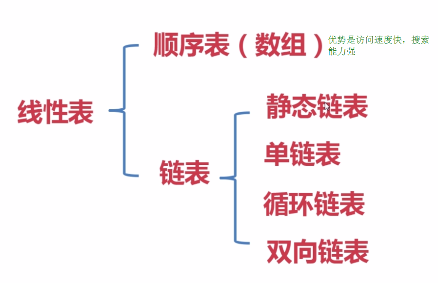

对于一个有限序列，查找其中的元素，追加、插入、删除元素，都是很常见的操作。对线性表的研究，就是在各种类型的线性表中，实现这些操作。

## 顺序表

### 定义
顺序表，一般使用数组实现，事实上就是在内存中找个初始地址，然后通过占位的形式，把一定连续的内存空间给占了，然后把相同数据类型的数据元素依次放在这块空地中，数组大小有两种方式指定，一是静态分配，二是动态扩展。

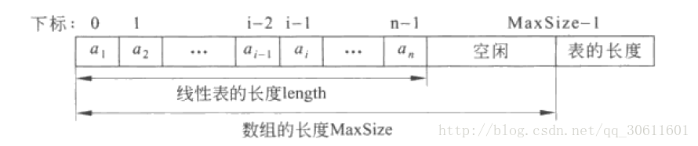


### 查找
```cpp
//按位查找
DataType SeqList<DataType>::Get(int i)
{
    if(i<1 && i>length) throw "wrong Location";
    else return data[i-1];
}
//按值查找
int SeqList<DataType>::Locate(DataType x)
{
    for(int i=0;i<length;i++)
        if(data[i]==x) return i+1;
    return 0;
}
```

###  插入

顺序表插入主要需要解决的是在插入位置的元素依次向后移动的问题。如果表满了，则引发上溢；如果插入位置不合理，则引发位置异常。


```cpp
template <class DataType>
void SeqList<DataType>::Insert(int i,DataType x)
{
    if(length>=MaxSize) throw "Overflow";
    if(i<1 || i>length+1) throw "Location";
    for(int j=length;j>=i;j--)
        data[j]=data[j-1];
    data[i-1]=x;
    length++;
}
```


### 删除

注意算法中元素移动方向，移动元素之前必须取出被删的元素，如果表为空则发生下溢，如果删除位置不合理，则引发删除位置异常。·

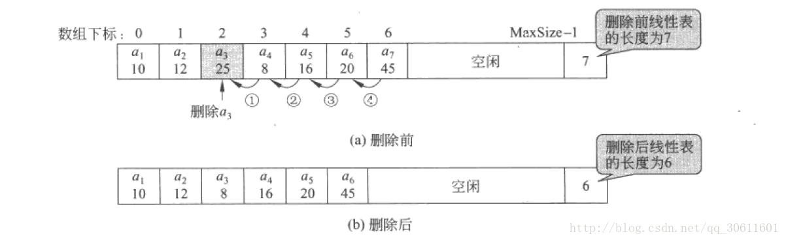

```cpp
template <class DataType>
DataType SeqList<DataType>::Delete(int i)
{
    int x;
    if(length==0) throw "Underflow";
    if(i<1 || i>length) throw "Location";
    x = data[i-1];
    for(int j=i;j<length;j++)
        data[j-1] = data[j];
    length--;
    return x;
}
```

### 顺序表的优缺点

优点：

随机访问特性，查找O(1)时间，存储密度高；

逻辑上相邻的元素，物理上也相邻；

无须为表中元素之间的逻辑关系而增加额外的存储空间；

缺点：

插入和删除需移动大量元素；

当线性表长度变化较大时，难以确定存储空间的容量；

造成存储空间的“碎片”


## 单链表

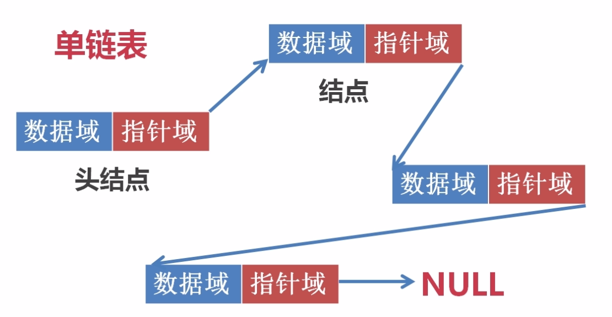

### 定义
线性表的链式存储结构的特点是用一组任意的存储单元存储线性表的数据元素，这组存储单元可以是连续的，也可以是不连续的。这就意味着，这些元素可以存在内存未被占用的任意位置。

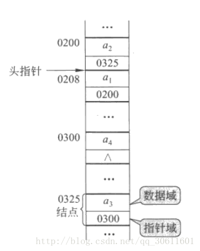

链表的定义是递归的，它或者为空null，或者指向另一个节点node的引用，这个节点含有下一个节点或链表的引用，线性链表的最后一个结点指针为“空”（通常用NULL或“^”符号表示）。


### 存储方法

```cpp
template<class DataType>
struct Node
{
    DataType data;              //存储数据
    Node<DataType> *next;       //存储下一个结点的地址
};
```
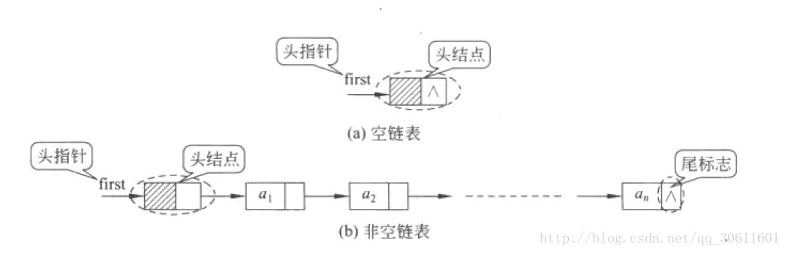

特点：

用一组任意的存储单元存储线性表的数据元素， 这组存储单元可以存在内存中未被占用的任意位置
顺序存储结构每个数据元素只需要存储一个位置就可以了，而链式存储结构中，除了要存储数据信息外，还要存储它的后继元素的存储地址

显然，使用单链表的时候需要new Node，才能开辟出新的空间来。

### 尾插法构造

每次将新申请的结点插在终端节点的后面

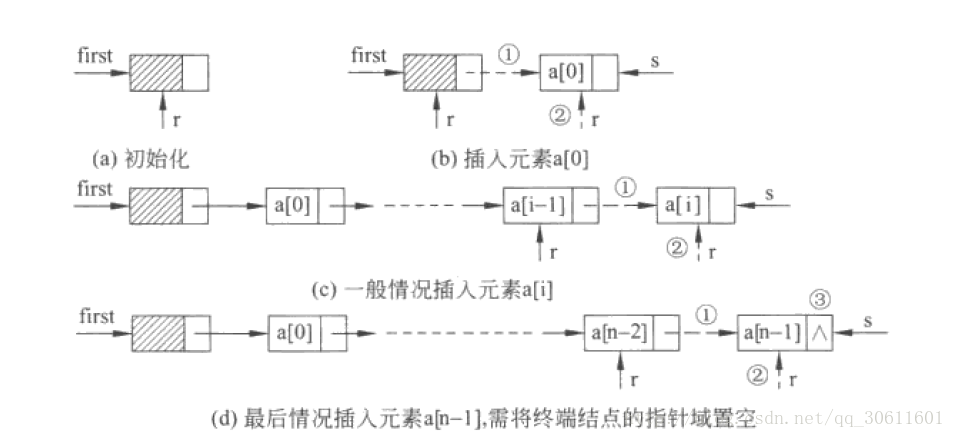

```cpp
template<class DataType>
LinkList<DataType>::LinkList(DataType a[], int n)
{
    first = new Node<DataType>;
    Node<DataType> *r = first;
    for (int i = 0; i < n; i++)
    {
        Node<DataType> *s = new Node<DataType>;
        s->data = a[i];
        r->next = s;
        r = s;
    }
    r->next = NULL;
}
```
### 计算长度

单链表的长度需要遍历到next
```cpp
template<class DataType>
int LinkList<DataType>::Length()
{
    Node<DataType>* p = first->next;
    int count = 0;
    while (p != NULL)
    {
        p = p->next;
        count++;
    }
    return count;
}
```

### 查找

无论是按位还是按值查找，都需要遍历整个链表，时间复杂度为O(n).

```cpp

//按位查找
template<class DataType>
DataType LinkList<DataType>::Get(int i)
{
    Node<DataType>* p = first->next;
    int count = 1;
    while (p != NULL && count<i)
    {
        p = p->next;
        count++;
    }
    if (p == NULL) throw "Location";
    else return p->data;
}

//按值查找
template<class DataType>
int LinkList<DataType>::Locate(DataType x)
{
    Node<DataType> *p = first->next;
    int count = 1;
    while (p != NULL)
    {
        if (p->data == x) return count;
        p = p->next;
        count++;
    }
    return 0;
}
```

### 插入

单链表在插入过程中需要注意分析在表头、表中间、表尾的三种情况，由于单链表带头结点，这三种情况的操作语句一致，不用特殊处理，时间复杂度为O(n)

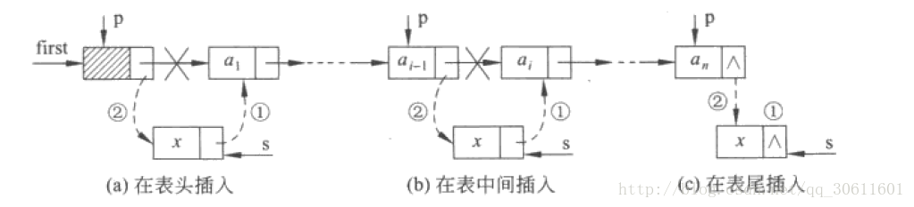

```cpp
template<class DataType>
void LinkList<DataType>::Insert(int i, DataType x)
{
    Node<DataType> *p = first;
    int count = 0;
    while (p != NULL && count<i - 1)
    {
        p = p->next;
        count++;
    }
    if (p == NULL) throw "Location";
    else {
        Node<DataType> *s = new Node<DataType>;
        s->data = x;
        s->next = p->next;
        p->next = s;
    }
}
```
### 单链表删除

删除操作时需要注意表尾的特殊情况，此时虽然被删结点不存在，但其前驱结点却存在。因此仅当被删结点的前驱结点存在且不是终端节点时，才能确定被删节点存在，时间复杂度为O(n) .

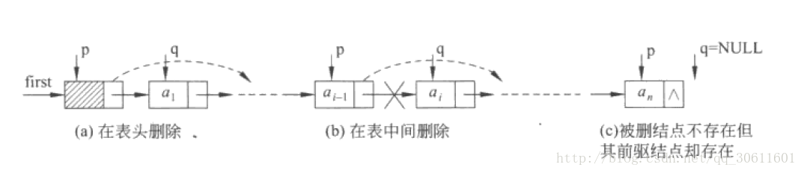

```cpp
template<class DataType>
DataType LinkList<DataType>::Delete(int i)
{
    Node<DataType> *p = first;
    int count = 0;
    while (p != NULL && count<i - 1)
    {
        p = p->next;
        count++;
    }
    if (p == NULL || p->next == NULL) throw "Location";
    else {
        Node<DataType> *q = p->next;
        int x = q->data;
        p->next = q->next;
        return x;
    }
}
```

### 链式存储的优缺点

优点：

插入、删除不需移动其他元素，只需改变指针.
链表各个节点在内存中空间不要求连续，空间利用率高

缺点：

查找需要遍历操作，比较麻烦


## 循环链表

循环链表是另一种形式的链式存储结构。它的特点是表中最后一个结点的指针域指向头结点，整个链表形成一个环。（通常为了使空表和非空表的处理一致，通常也附加一个头结点）

  在很多实际问题中，一般都使用尾指针来指示循环链表，因为使用尾指针查找开始结点和终端结点都很方便。

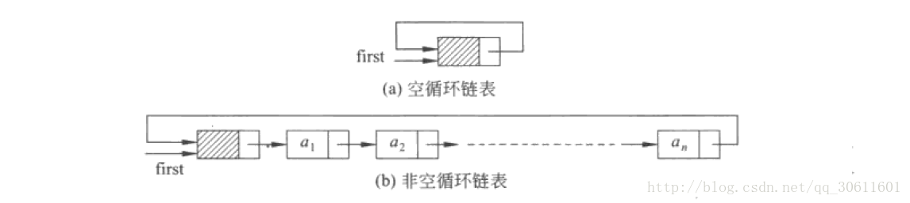


  循环链表没有增加任何存储量，仅对链接方式稍作改变，循环链表仅在循环条件与单链表不同。从循环链表的任一结点出发可扫描到其他结点，增加了灵活性。但是，由于循环链表没有明显的尾端，所以链表操作有进入死循环的危险。通常以判断指针是否等于某一指定指针来判定是否扫描了整个循环链表。


### 循环链表范例

**约瑟夫环：**

约瑟夫环（约瑟夫问题）是一个数学的应用问题：已知 n 个人（以编号1，2，3…n分别表示）围坐在一张圆桌周围。从编号为 k 的人开始报数，数到 m 的那个人出圈；他的下一个人又从 1 开始报数，数到 m 的那个人又出圈；依此规律重复下去，直到剩余最后一个胜利者。

#### 数组求解

用数组求解的基本思想就是用一个一维数组去标识这 n 个人的状态，默认全为 1 ，也就是都在圈子内，当数到 m的人出圈之后，标识置为 0（就是出圈了），同时报数器清 0，下一个人要从 1 开始。在每次报数之前要判断他是否在圈子内（也就是他的标识是否为 1 ），如果在圈子里面才会继续报数。定义一个变量记录出圈的人数， 出圈的人数等于  n-1 时，则游戏结束。

```cpp
#include<stdio.h>
#define N 1000000 //记录玩游戏最大人数
int flag【N】 = {0};
int main()
{
    int n = 0, m = 0;
    scanf("%d%d", &n, &m);//输入玩游戏人数和计数m
    int i = 0;
    int count = 0;  //记录已经出圈的人数
    int num = 0;    //报数器
    for(i = 1; i <= n; i++) {
        flag【i】 = 1;//所有人入圈
    }
    while(count < n - 1) {
        for(i = 1; i <= n; i++ ) {
            if (1 == flag【i】) {//在未出圈的人数中计数
                num++;
                if(num == m) {//此人数到m则出圈
                    printf("%dn", i);
                    count++;//出圈人数加1
                    flag【i】 = 0;//出圈
                    num = 0;
                }
                if(count == n - 1) {
                    break;
                }
            }
        }
    }
    for(i = 1; i <= n; i++) {
        if(1 == flag【i】) {//输出赢家，标识为1
            printf("The last one is : %dn", i);
        }
    }
    return 0;
}
```

#### 循环链表解法

约瑟夫环问题可以转化为循环链表的数据结构来求解。可以将每个人看做链表的单个节点，每个节点之间通过链表的 next 指针连接起来，并且将链表末尾节点指向头节点就形成的环，由链表构成的环形结构在数据结构中称为循环链表。


```cpp
#include <stdio.h>
#include <stdlib.h>

/*声明一个链表节点*/
typedef struct node  
{
    int number;//数据域，存储编号数值
    struct node *next;//指针域，指向下一个节点
}Node;

/*创建链表节点的函数*/ 
Node* CreatNode(int x) 
{
    Node *p;
    p = (Node*)malloc(sizeof(Node));
    p->number = x;//将链表节点的数据域赋值为编号
    p->next = NULL;
    return p;
}

/*创建环形链表，存放整数1到n*/
Node* CreatJoseph(int n) 
{
    Node *head,*p,*q;
    int i;
    for(i = 1;  i <= n; i++)
    {
        p = CreatNode(i);//创建链表节点，并完成赋值
        if(i == 1)//如果是头结点
            head = p;
        else//不是头结点，则指向下一个节点
            q->next = p;
            q = p;
    }
    q->next = head;//末尾节点指向头结点，构成循环链表
    return head;
}

/*模拟运行约瑟夫环，每数到一个数，将它从环形链表中删除，并打印出来*/
void RunJoseph(int n,int m) 
{
    Node *p,*q;
    p = CreatJoseph(n);//创建循环链表形式的约瑟夫环
    int i;
    while(p->next != p)//循环条件，当前链表数目大于1
    {
        for(i = 1; i < m-1; i++)//开始计数
        {
            p = p->next;
        }
        //第m个人出圈
        q = p->next;
        p->next = q->next;
        p = p->next;
        printf("%d--",q->number);//输出出圈的序号
        free(q);
    }
    printf("n最后剩下的数为：%dn",p->number);
}

int main()
{
    int n,m;
    scanf("%d %d",&n,&m);
    RunJoseph(n,m);
    return 0;
}
```


## 静态链表

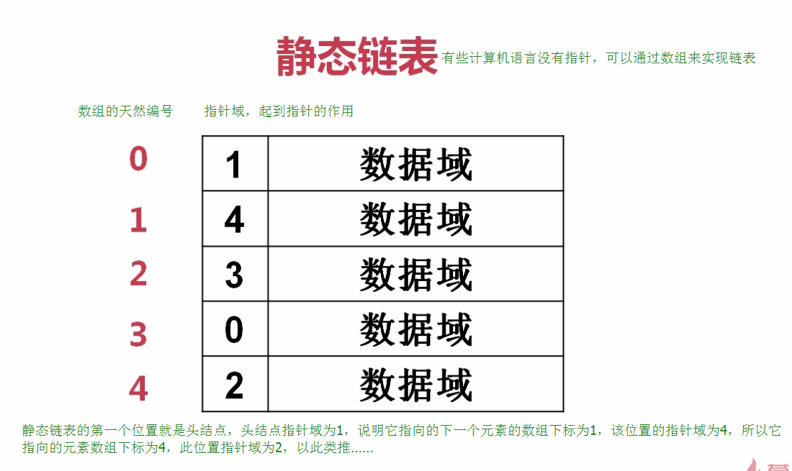

### 存储方式

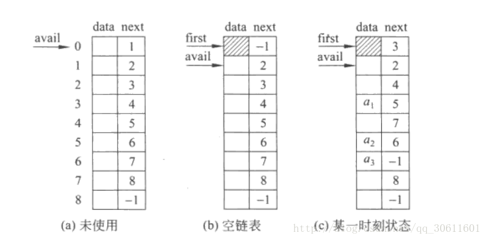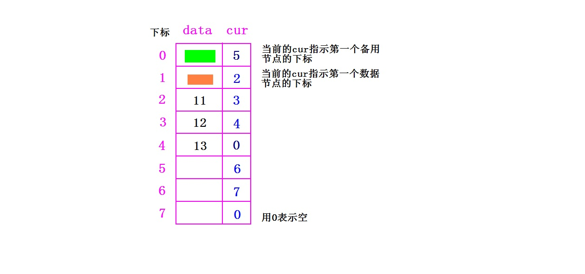

图中用彩色途上的是两个头结点，不存放数据，分别用来记录第一个备用节点和第一个数据节点的下标。

```cpp
typedef class StaticListNode  // 静态链表的节点类型（数组元素类型）
{
  int data;       // 值域
  int   cur;        // 游标 （指示当前节点的下一个元素下标）
}StaticListNode;
```


### 插入

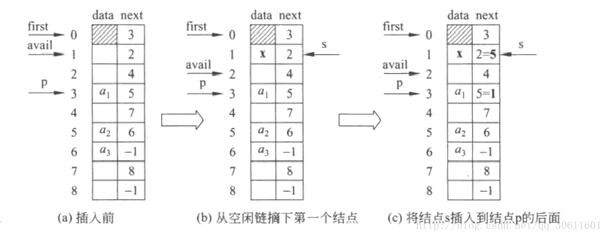

### 删除

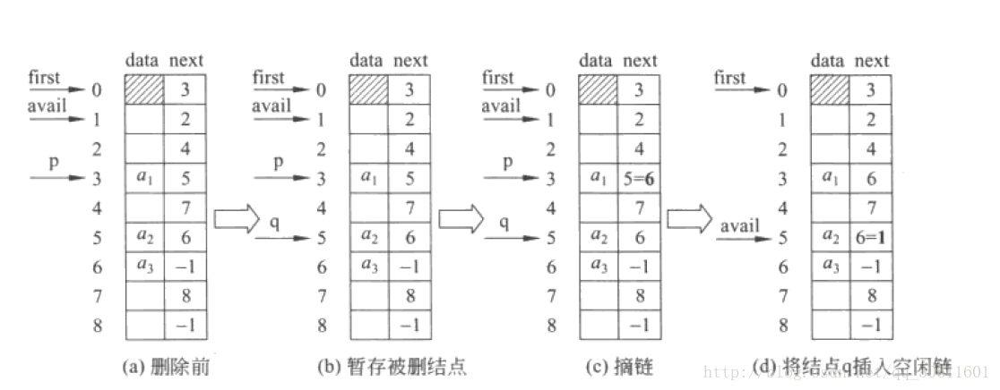

```cpp
#include<iostream>
#define OK 1
#define ERROR 0
#define TRUE 1
#define FALSE 0

#define MAXSIZE 10

typedef int Status;

typedef struct List
{
	int data = 0;//数据
	int cur;//游标
}StaticLinkList;

//检测链表长度
int Listlength(StaticLinkList *list)
{

	int tcur = list[MAXSIZE - 1].cur;
	int length = 0;
	while (tcur != 0)
	{
		tcur = list[tcur].cur;
		length++;
	}
	if (length >= MAXSIZE - 2)
	{
		std::cout << "链表已满\n";
		system("pause");
	}
	return length;
}

//初始化
Status Initlist(StaticLinkList *list)
{
	int i;
	for (i = 0; i < MAXSIZE; i++)
	{
		list[i].cur = i + 1;//每一个元素的游标，都记录着下一个元素的下标
	}
	list[MAXSIZE - 1].cur = 0;
	return OK;
}

//插入
int Malloc_SLL(StaticLinkList *list)//返回第一个空闲分量的下标，同时把下一个空闲分量留作备用
{
	int i = list[0].cur;//将第一个空闲分量（代插入位置）的下标，用i存下来
	if (list[i].cur != 0)//如果不是空链表
	{
		list[0].cur = list[i].cur;//把下一个空闲分量留作备用
	}
	return i;//返回第一个空闲分量的下标
}
Status ListInsert(StaticLinkList *L, int i, int e)//在i位置插入元素e
{
	int j;//第一个空闲分量的下标
	int k;
	int l;
	k = MAXSIZE - 1;//数组最后一个元素的下标
	if (i<1 || i>Listlength(L) + 1)
	{
		std::cout << "位置超出范围\n";
		return ERROR;
	}
	j = Malloc_SLL(L);//第一个空闲分量的下标，也就是新节点的下标

	if (j != 0)//如果备用链表不为空
	{
		L[j].data = e;//把数据放进备用位置
		for (l = 1; l < i; l++)//根据想要插入的位置i，找到被插入节点的下标j
		{
			k = L[k].cur;
		}
		L[j].cur = L[k].cur;//L[j].cur是新节点游标，另其指向被插入的节点游标L[k].cur
		L[k].cur = j;//L[k].cur是被插入的节点的游标指向，另其指向新节点下标j
		return OK;
	}
	return ERROR;
}
//删除
//将下标为k的空闲节点回收到备用链表
void Free_SLL(StaticLinkList *L, int k)
{
	L[k].cur = L[0].cur;//让k节点的游标指向第一个备用链表节点
	L[0].cur = k;//让数组第一个元素的游标指向k节点
}

Status ListDelete(StaticLinkList *L, int i)
{
	int j;
	int k;
	if (i<1 || i>Listlength(L))
	{
		std::cout << "位置超出范围\n";
		return ERROR;
	}
	k = MAXSIZE - 1;
	for (j = 1; j < i; j++)
	{
		k = L[k].cur;
	}
	j = L[k].cur;
	L[k].cur = L[j].cur;
	Free_SLL(L, j);
	return OK;
}

//打印
void print(StaticLinkList *L)
{
	int tcur = L[MAXSIZE - 1].cur;
	while (tcur != 0)
	{
		std::cout << L[tcur].data << " ";
		tcur = L[tcur].cur;
	}
	std::cout << std::endl;
}

int main()
{
	Status checker;
	StaticLinkList staticLinkList[MAXSIZE];
	checker = Initlist(staticLinkList);

	int i;//想插入的位置
	int e;//想插入的数据
	for (checker = TRUE; checker != ERROR;)
	{
		print(staticLinkList);
		std::cout << "\n(最大长度" << MAXSIZE - 2 << ") 插入:位置 数据 ";
		std::cin >> i >> e;
		checker = ListInsert(staticLinkList, i, e);
	}

	//删除
	for (checker = TRUE; checker != ERROR;)
	{
		print(staticLinkList);
		std::cout << "删除:位置 ";
		std::cin >> i;
		checker = ListDelete(staticLinkList, i);
	}
	system("pause");
```


静态链表虽然是用数组来存储线性表的元素，但在插入和删除操作时，只需要修改游标，不需要移动表中的元素，从而改进了在顺序表中插入和删除操作需要移动大量元素的缺点，但是它并没有解决连续存储分配带来的表长难以确定的问题。


## 其他链表介绍

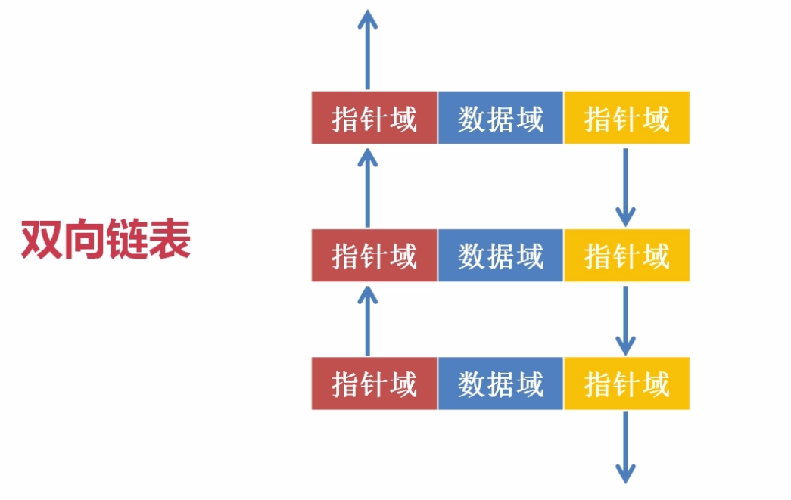
