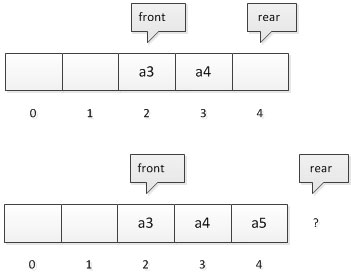

# 队列Queue

## 定义

队列Queue也是线性表，可以用数组(由于假溢出的原因使用循环数组)和链表来实现。

就和现实中我们的排队一样,队列具有先进先出（FIFO）的特点：第一个加入队列的元素可以且必须第一个出去。后面加入的元素必须排在队列的最后面，且必须等前面的人都出去了才能出去。

由于这样的特性，队列没有Insert，因为线性表的Insert可以插入在任何位置。
取而代之的是，队列通过Push操作来将新的元素排到队尾，通过Pop操作将队首元素取出。

队列通过front和rear来标记队首和队尾。

## 循环队列

假设是长度为5的数组，初始状态，空队列如所示，front与 rear指针均指向下标为0的位置。然后入队a1、a2、a3、a4, front指针依然指向下标为0位置，而rear指针指向下标为4的位置。

出队a1、a2，则front指针指向下标为2的位置，rear不变，如下图所示，再入队a5，此时front指针不变，rear指针移动到数组之外。数组之外，那将是哪里？

为了解决这个问题，通常将队列设计为循环队列：

循环队列再插入新的元素X时进行如下处理:

首先将rear++,如果rear=5，那么rear=0。
此时如果rear=front，说明首尾重合了，此时应是真溢出。
否则a[rear]=x;

## 范例

假设在周末舞会上，男士们和女士们进入舞厅时，各自排成一队。跳舞开始时，依次从男队和女队的队头上各出一人配成舞伴。规定每个舞曲能有一对跳舞者。若两队初始人数不相同，则较长的那一队中未配对者等待下一轮舞曲。

现要求写一个程序，模拟上述舞伴配对问题。

输入：

第一行两队的人数
第二行舞曲的数目

输出
共k行，每行两个数，表示配对舞伴的序号，男士在前，女士在后。

样例输入

    4 3
    6

样例输出

    1 1
    2 2
    3 3
    4 1
    1 2
    2 3

分析：

设计两个队列分别存放男士和女士。
每对跳舞的人一旦跳完后就回到队尾等待下次被选。

