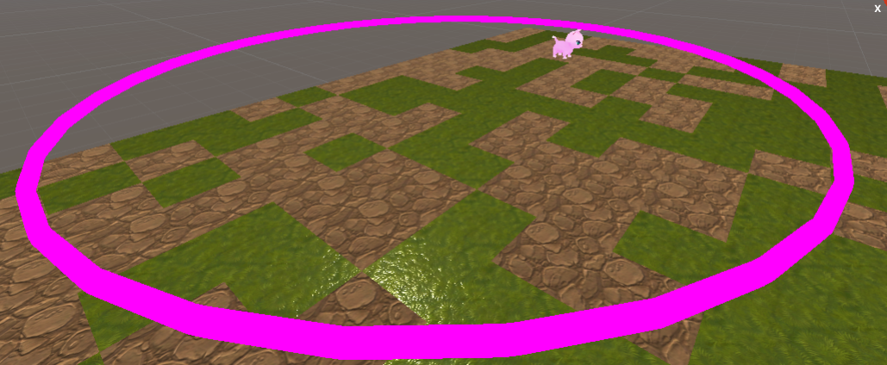
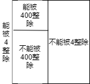

C++基本语法

# 1 从C#版的Scratch开始

https://github.com/auvgfw/GamerAsset_Unity_Lesson.git



```cpp
int i;//int的翻译:定义一个整型变量，其名称为i。掌握这个描述方便后面理解float、char、数组、结构体、函数、对象。
for (i = 0; i <36; i++)
{
    Go(1);
    Turn(10)；
}
```

第一次上课时通过Go/Turn顺序结构的程序让学生画图即可。
可逐步加难任务，引入变量的概念。

## 基本语法知识点

* 分号结尾
* 变量使用前先定义
* 赋值

# 2 while、for、if

通过画正方形的问题，先引入循环知识；相对来说，循环更"实用",且更容易引起学生兴趣。

```cpp
i=0;  //注意while要设初始值
while(i>1) //循环条件
{   //循环时要做的事情
    Go(2);
    Turn(90);
    i++；//提醒学生注意
}
```

* while的翻译：当
* 一定要带领学生一步一步走一遍循环
* 要让学生学会分析while循环将运行多少次。
* 讲解i++、i=i+1、i+=1

为了防止忘记设初始值、i++，C++还提供了for循环

```cpp
for(i=0;i<10;i++)//初始值、循环条件、每次循环要做的事情
{
    Go(2);
    Turn(90);
}
```

* 学会分析i=0;i<10与i=1;i<10与i=0;i<=10与i=1;i<=10各循环多少次
* 分析将10换成N，会循环多少次，学会使用N+1，N-1这样的数学语言来描述问题（在后面的数组应用中特别重要)
* 次数不明确、终止条件明确的循环，用while写会更好理解一些（拆分数字）

```cpp
if(condition)
{
    do();
}
```

* if与while的区别：一个是满足条件时一直执行，一个是满足条件时执行。
* 强调，一定要加大括号。

# 2.进入真正的C++世界

我不太建议为了追求简单，用helloworld作为起手式。
还记得上节课说的拆分数字的题目吗？让我们用C++实现它。

## 顺序结构的版本

```cpp
#include<iostream>
using namespace std;
int main()
{
    int n=3416;
    int a;
    int b;
    int c;
    int d;
    a=n/1000;
    b=n/100%10;
    c=n/10%10;
    d=n%10;
    cout<<a;
    cout<<",";
    cout<<b;
    cout<<",";
    cout<<c;
    cout<<",";
    cout<<d;
    cout<<endl;
}
```

注意事项：

* 定义变量
* 定义变量的同时初始化
* 赋值：可以为变量赋值常量、赋值其他变量、赋值由变量+常量+运算符组成的表达式
* 介绍+ - * / %运算符
* 对/和%展开更进一步的讨论，如截取最后一位，判断奇数偶数
* 注意cout的写法，注意cout不会自动换行。一开始没必要让学生写成一串。
* 每行代码少一些，功能简单一些，方便进行debug，方便查看编译器输出的错误。

## 循环的版本

先分析程序中哪些东西是重复出现的，然后用循环来代替。

```cpp
int main()
{
    int n=3516;
    int a;
    while(n!=0)//让学生思考，什么时候应当继续循环?
    {
        a=n%10;
        cout<<a;
        n=n/10;
    }
}
```

* 除了让代码更简洁以外，循环让n可以为任意位数。
* 既然n可以是任何数，不放在运行时输入，引入cin>>
* 讲解cin同样是一种赋值

## 另一种while

```cpp
int main()
{
    int n=3516;
    int a;
    while(true)
    {
        a=n%10;
        cout<<a;
        n=n/10;
        if(n==0)
        {
            break;
        }
    }
}
```

* 详细分析while和if的括号里是什么(condition),讲解布尔变量
* 讲解布尔运算，与/或/非
* 指出break的条件与上一个while的条件相反
* 强调==

## 选择结构

* 带领学生练习判断闰年的程序，画图




```CPP
using namespace std;

#include "iostream"

int main()

{

    int year=0;

    cout<<"请输入判断的年份：";

    cin>>year;

    if(year<=0)

    {

        cout<<"输入的年份不能为负数。"<<endl;

        return 0;

    }

    if((year%4==0 && year%100!=0)||year%400==0)

    cout<<year<<"年是闰年"<<endl;

    else

    cout<<year<<"年是平年"<<endl;

    return 0;

}
```

## 循环结构

## 判断素数

只需要验证，对于任意的M（$1<M<\sqrt{N}$）,都有M无法整除N，即可确认N是素数。

```cpp
#include <iostream>
#include <cmath>
using namespace std;

int main(){
    int n;
    cin >> n;
    for(int i=2; i<=sqrt(n); i++){
        if(n%i == 0){
            cout << n << " isn't a prime" << endl;
            return 1;
        }
    }
    cout << n << " is a prime" << endl;
    return 0;
}
```

## 筛素数

埃拉托斯特尼筛法（sieve of Eratosthenes ） 是古希腊数学家埃拉托斯特尼发明的计算素数的方法。对于求解不大于n的所有素数，我们先找出sqrt(n)内的所有素数p1到pk，其中k = sqrt(n)，依次剔除Pi的倍数，剩下的所有数都是素数。
具体操作如上述 图片所示

```cpp
#include<iostream>
#include<vector>
using namespace std;
 
int main(){
    int n;
    cin>>n;
    vector<bool> isprime(n+5, true);
    vector<int> ans;
    for(int i = 2; i <= n; i++){
        if(isprime[i]){
            ans.push_back(i);
            for(int j = i * i; j <= n; j += i)isprime[j] = false;
        }
    }
    for(auto i : ans)cout<<i<<" ";
    cout<<endl;
    return 0;
}
```


