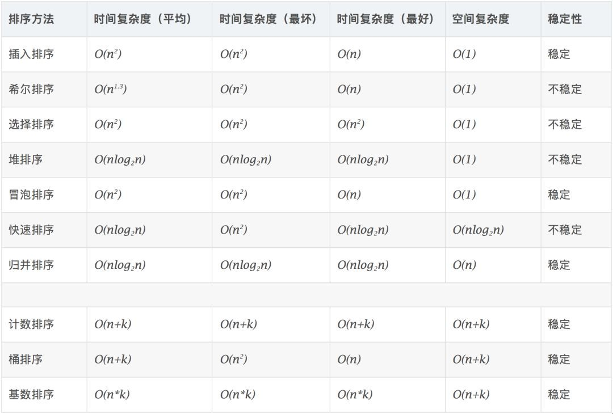
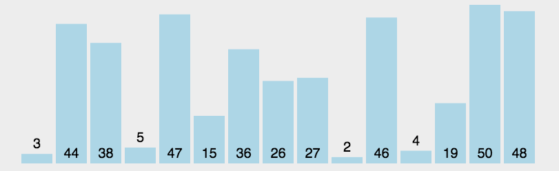
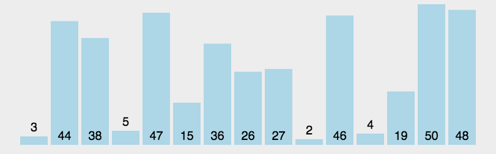

# 一维数组

## 导入

在问题[P5705 数字反转](https://www.luogu.com.cn/problem/P5705)中，很多学生习惯于使用abcd4个变量来存储其中的每一位数字，那么，如果需要处理的数字位数更多怎么办?

* 数组的作用：一次性定义一组变量，这些变量存在关联性，便于我们访问。

数组可用来存储一系列数据，但它往往被认为是一系列相同类型的变量。

数组的声明并不是声明一个个单独的变量，比如 number0、number1、...、number99，而是声明一个数组变量，比如 numbers，然后使用 numbers[0]、numbers[1]、...、numbers[99] 来代表一个个单独的变量。数组中的特定元素可以通过索引访问。

所有的数组都是由连续的内存位置组成。最低的地址对应第一个元素，最高的地址对应最后一个元素。

## 数组的定义方法

```cpp
type arrayName [ arraySize ];
int a[10];
//上面的代码定义了一个整型数组，其名称为a，里面包含10个元素，分别是a[0],a[1]...a[9]
double b[100];
//让学生描述上面这行代码。
long long numbers[100000];
//让学生描述上面这行代码。
```
任何一个变量在使用的过程中都离不开赋值于访问这两件事，数组也是如此。

## 数组初始化

三种方法

1. 直接在定义时初始化

```cpp
int a[10]={1,2,3,4,5,6,7,8,9,0};//注意用逗号隔开
int b[5]={1,2,3};//后面的元素自动设为0。
int c[]={1,2,3,4,5,6};//自动使用大括号里的元素个数定义数组c的元素个数
```
* 全局变量中定义的数组默认初始值全部为0,局部变量中定义的数组初始值为随机数。

2. 在for中初始化为随机数

```cpp
int a[10];
for (int i=0;i<100;i++)
{
    a[i]=rand()%100;//rand()为任意随机数，通过%规范随机数的范围。看情况可以+1
}
```

3. 通过Cin初始化(竞赛模板)
```cpp
int a[10];
int n;
cin>>n;
for(int i=0;i<n;i++)
{
    cin>>a[i];
}
```

## 访问数组中的元素

灵活的访问数组的下标是用好数组的前提条件，像a[i],a[10-i],a[i*2],a[i+1],a[i-2]都是很常见的访问数组中的元素的方式。

  **范例：逆序输出Fibonacci数列** 

该数列的递推公式为

$F_n=F_{n+1}+F_{n+2}(n>=2,F_0=0,F_1=1)$

代码如下：

```cpp
#include<iostream>
using namespace std;
int main()
{
    int a[20];
    int i;
    a[0]=0;
    a[1]=1;
    for(i=2;i<20;i++)
    {
        a[i]=a[i-2]+a[i-1];
    }
    for(i=19;i>=0;i--)
    {
        cout<<a[i]<<" ";
    }
    system("pause");
    return 0;
}
```

**范例：旅馆里有100个房间，从1到100编了号，第一个服务员把所有的房间门都打开了，第二个服务员把所有编号是2的倍数的房间“相反处理”，第三个服务员把所有3的倍数的房间“相反处理”……，以后都是如此。问第100个服务员来过后，哪几扇门是打开的**

```cpp
#include<iostream>
using namespace std;
int a[101] = {0};
int main(){
    int i, j;
    for(i = 1; i <= 100; ++i){
        for(j = 1; j <= 100; ++j){
            if(j % i == 0){
                if(a[j] == 0){
                    a[j] = 1;
                } else {
                    a[j] = 0;
                }               
            }
        }
    }
    for(i = 1; i <= 100; ++i){
        if(a[i] == 1){
            cout<<i<<" ";
        } 
    }
    return 0;
}
```
少做几次循环的版本
```cpp
    int i,j;
    for(i=1;i<=100;i++)
    {
        for(j=1;j*i<=100;j++)
        {
            b[j*i]=!b[j*i];
        }

    }
    for(i=1;i<=100;i++)
    {
        if(b[i])
        {
            cout<<i<<" ";
        }
    }
    system("pause");
}
```

## 数组排序

当变量从一个变为一组的时候，许多和数列、集合有关的问题也就自然而然的产生了 ，排序则是其中的典型问题之一。

不同的排序算法有着不同的**时间复杂度**。




大多数排序算法都需要将数字进行互相对比，并通过一定的策略进行交换；好的交换策略可以缩短排序时间。


### 预备问题：求最大值
求出数组a[10]中的最大值。

```cpp
#include <iostream>
const double max_value(double arr[], double size);
using namespace std;
int main()
{
    double arr[] = {2, 4, 1, 7, 3};
    double size = 5.0;
    double max = arr[0];
    for (int i = 1; i < size; i++)
    {
        if (max < arr[i])
        {
            max = arr[i];
        }
    }
    cout << "the max value of arrary is:" << max << endl;
    system("pause");
}
```

### 选择排序

**算法描述**

选择排序（Select Sort） 是直观的排序，通过确定一个 Key 作为最大或最小值，再从带排序的的数中找出最大或最小的交换到对应位置。再选择次之。双重循环时间复杂度为 O(n^2)。

**步骤**

1.在一个长度为 N 的无序数组中，第一次遍历 n-1 个数找到最小的和第一个数交换。

2.第二次从下一个数开始遍历 n-2 个数，找到最小的数和第二个数交换。

3.重复以上操作直到第 n-1 次遍历最小的数和第 n-1 个数交换，排序完成。





```cpp
void SelectionSort(int* h, size_t len)
{
    if(h==NULL) return;
    if(len<=1) return;

    int minindex,i,j;
    //i是次数，也即排好的个数;j是继续排
    for(i=0;i<len-1;++i)
    {
        minindex=i;
        for(j=i+1;j<len;++j)
        {
            if(h[j]<h[minindex]) minindex=j;
        }
        Swap(h[i],h[minindex]);
    }

    return;
}
```


### 冒泡排序

**算法描述**

冒泡排序（Bubble Sort） 最为简单的一种排序，通过重复走完数组的所有元素，通过打擂台的方式让元素两个两个的比较，直到没有数可以交换的时候结束这个数，再到下个数，直到整个数组排好顺序。因一个个浮出所以叫冒泡排序。双重循环，时间复杂度 O(n^2)

**步骤**

1.比较相邻两个数据，如果第一个比第二个大，就交换两个数。

2.对每一个相邻的数做同样1的工作，这样从开始一队到结尾一队在最后的数就是最大的数。

3.针对所有元素上面的操作，除了最后一个。

重复1~3步骤，直到排序完成。


```cpp
void BubbleSort(int* h, size_t len)
{
    if(h==NULL) return;
    if(len<=1) return;
    //i是次数，j是具体下标
    for(int i=0;i<len-1;++i)
        for(int j=0;j<len-1-i;++j)
            if(h[j]>h[j+1])
                Swap(h[j],h[j+1]);

    return;
}
```
### 快速排序

**算法描述**

快速排序（QuickSort）是排除稳定性因素后最常用的排序，快速排序是C.R.A.Hoare于1962年提出的一种划分交换排序。它采用了一种分治的策略，通常称其为分治法(Divide-and-ConquerMethod)。它的平均时间复杂度为O(nlogn)，最坏时间复杂度为O(n^2)。快速排序也是STL的算法库中提供的标准排序算法。

**步骤**

1.从数列中挑出一个元素作为基准。
2.重新排列数列，把所有的比基准小的放在基准前面，反之放在后面（一样大可任意一边）完成后基准处在分区的中间位置。
3.通过递归调用把小于基准元素和大雨基准元素的子序列进行排序。



 ```cpp
//快速排序，随机选取哨兵放前面
void QuickSort(int* h, int left, int right)
{
    if(h==NULL) return;
    if(left>=right) return;

    //防止有序队列导致快速排序效率降低
    srand((unsigned)time(NULL));
    int len=right-left;
    int kindex=rand()%(len+1)+left;
    Swap(h[left],h[kindex]);

    int key=h[left],i=left,j=right;
    while(i<j)
    {
        while(h[j]>=key && i<j) --j;
        if(i<j) h[i]=h[j];
        while(h[i]<key && i<j) ++i;
        if(i<j) h[j]=h[i];
    }

    h[i]=key;

    //QuickSort(&h[left],0,i-1);
    //QuickSort(&h[j+1],0,right-j-1);

    QuickSort(h,left,i-1);
    QuickSort(h,j+1,right);
}
```
**STL中的快速排序**

C++的STL使用快速排序算法作为sort操作的标准算法，其使用方法为：

```cpp
#include<iostream>
#include<algorithm>//使用sort函数必须引入该库
using namespace std;
main()
{
　　//sort函数第三个参数采用默认从小到大
　　int a[]={45,12,34,77,90,11,2,4,5,55};
　　sort(a,a+10);
　　for(int i=0;i<10;i++)
　　cout<<a[i]<<" ";
}
```

## 二分查找

对大量数据的排序、查找是信息技术的典型研究对象。
对于一维数组来说，依靠逐个遍历的方法可以很轻易的查找某个“值”是否包含在数组中，但当数组的元素较多、查找请求较多时，这种方法就不太适用了。
二分查找法是一种对已经排好序的线性表的查找方法，过程如下：

1.假设表中元素是按升序排列，将表中间位置记录的关键字与查找关键字比较
2.如果两者相等，则查找成功；否则利用中间位置记录将表分成前、后两个子表
3.如果中间位置记录的关键字大于查找关键字，则进一步查找前一子表，否则进一步查找后一子表。
重复1-3过程，直到找到满足条件的记录，使查找成功，或直到子表不存在为止，此时查找不成功。

```cpp
#include "stdafx.h"
#include <iostream>
using namespace std;
 
/*
 * @name   BinarySearchRecursion
 * @brief  二分查找递归实现
 * @param  [in] int * pArray	查找的有序数组(升序)
 * @param  [in] int nBegin		查找数组的起始下标
 * @param  [in] int nEnd		查找数组的结束下标
 * @param  [in] int nKey		查找的目标值
 * @return int	-1为目标数组无nKey值，其他值数组元素值为nKey的下标
 */
int BinarySearchRecursion(int* pArray, int nBegin, int nEnd, int nKey)
{
	if (NULL == pArray || nBegin > nEnd)
	{
		return -1;
	}
	int nMid = (nBegin + nEnd) / 2;
	if (pArray[nMid] == nKey)
	{
		return nMid;
	}
	else if (pArray[nMid] > nKey)
	{
		return BinarySearchRecursion(pArray, nBegin, nMid - 1, nKey);
	}
	else
	{
		return BinarySearchRecursion(pArray, nMid + 1, nEnd, nKey);
	}
}
```
