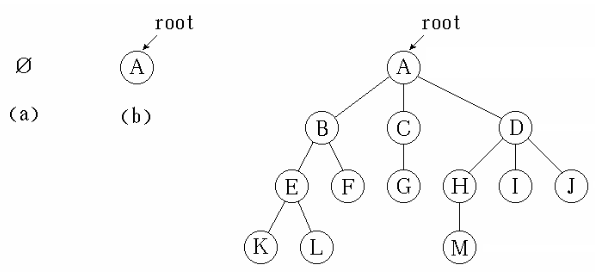
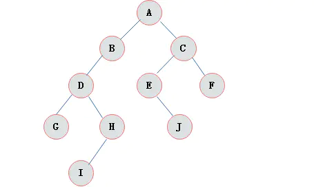
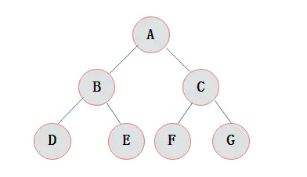
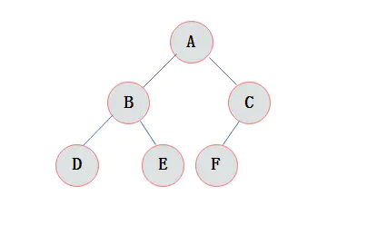
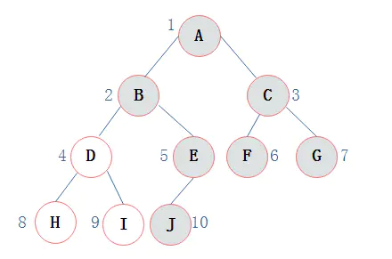
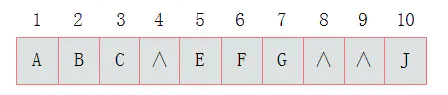
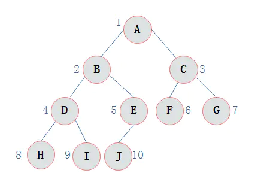

# 树

## 定义

树（tree）是包含n（n>0）个节点的有穷集合，其中：

（1）每个元素称为节点（node）；

（2）有一个特定的节点被称为根节点或树根（root）。

（3）除根节点之外的其余数据元素被分为m（m≥0）个互不相交的结合T1，T2，……Tm-1，其中每一个集合Ti（1<=i<=m）本身也是一棵树，被称作原树的子树（subtree）。

**树的定义具有递归性**

树具有以下特点：

（1）    每个节点有零个或多个子节点。

（2）    每个子节点只有一个父节点。

（3）    没有父节点的节点称为根节点。

**关于树的一些术语**

 节点的度：一个节点含有的子树的个数称为该节点的度；

        叶节点或终端节点：度为零的节点称为叶节点；

        非终端节点或分支节点：度不为零的节点；

        双亲节点或父节点：若一个结点含有子节点，则这个节点称为其子节点的父节点；

        孩子节点或子节点：一个节点含有的子树的根节点称为该节点的子节点；

        兄弟节点：具有相同父节点的节点互称为兄弟节点；

        
        节点的层次：从根开始定义起，根为第1层，根的子结点为第2层，以此类推；

        树的高度或深度：定义一棵树的根结点层次为1，其他节点的层次是其父结点层次加1。一棵树中所有结点的层次的最大值称为这棵树的深度。
        
        树的度：一棵树中，最大的节点的度称为树的度；

        节点的祖先：从根到该节点所经分支上的所有节点；

        子孙：以某节点为根的子树中任一节点都称为该节点的子孙。

        森林：由m（m>=0）棵互不相交的树的集合称为森林。

  

## 二叉树

### 定义

二叉树是n(n>=0)个结点的有限集合，该集合或者为空集（称为空二叉树），或者由一个根结点和两棵互不相交的、分别称为根结点的左子树和右子树组成。

  

### 二叉树特点
由二叉树定义以及图示分析得出二叉树有以下特点：

1）每个结点最多有两颗子树，所以二叉树中不存在度大于2的结点。

2）左子树和右子树是有顺序的，次序不能任意颠倒。

3）即使树中某结点只有一棵子树，也要区分它是左子树还是右子树。


### 二叉树的性质

1）在二叉树的第i层上最多有2i-1 个节点 。（i>=1）

2）二叉树中如果深度为k,那么最多有2k-1个节点。(k>=1）

3）n0=n2+1 n0表示度数为0的节点数，n2表示度数为2的节点数。


### 满二叉树

在一棵二叉树中。如果所有分支结点都存在左子树和右子树，并且所有叶子都在同一层上，这样的二叉树称为满二叉树。

满二叉树的特点有：

1）叶子只能出现在最下一层。。

2）非叶子结点的度一定是2。

3）在同样深度的二叉树中，满二叉树的结点个数最多，叶子数最多。


  


### 完全二叉树
对一颗具有n个结点的二叉树按层编号，如果编号为i(1<=i<=n)的结点与同样深度的满二叉树中编号为i的结点在二叉树中位置完全相同，则这棵二叉树称为完全二叉树。

  


特点：

1）叶子结点只能出现在最下层和次下层。

2）最下层的叶子结点集中在树的左部。

3）倒数第二层若存在叶子结点，一定在右部连续位置。

4）如果结点度为1，则该结点只有左孩子，即没有右子树。

5）同样结点数目的二叉树，完全二叉树深度最小。

5）在完全二叉树中，具有n个节点的完全二叉树的深度为[log2n]+1，其中[log2n]是向下取整。

6）若对含 n 个结点的完全二叉树从上到下且从左至右进行 1 至 n 的编号，则对完全二叉树中任意一个编号为 i 的结点有如下特性：

* 若 i=1，则该结点是二叉树的根，无双亲, 否则，编号为 [i/2] 的结点为其双亲结点;
* 若 2i>n，则该结点无左孩子， 否则，编号为 2i 的结点为其左孩子结点；
* 若 2i+1>n，则该结点无右孩子结点， 否则，编号为2i+1 的结点为其右孩子结点。

注：满二叉树一定是完全二叉树，但反过来不一定成立。

### 存储结构


  


  


### 遍历

#### 前序遍历

前序遍历通俗的说就是从二叉树的根结点出发，当第一次到达结点时就输出结点数据，按照先向左在向右的方向访问。

  


从根结点出发，则第一次到达结点A，故输出A;
继续向左访问，第一次访问结点B，故输出B；
按照同样规则，输出D，输出H；
当到达叶子结点H，返回到D，此时已经是第二次到达D，故不在输出D，进而向D右子树访问，D右子树不为空，则访问至I，第一次到达I，则输出I；
I为叶子结点，则返回到D，D左右子树已经访问完毕，则返回到B，进而到B右子树，第一次到达E，故输出E；
向E左子树，故输出J；
按照同样的访问规则，继续输出C、F、G；

前序遍历输出为：
ABDHIEJCFG

#### 中序遍历

中序遍历就是从二叉树的根结点出发，当第二次到达结点时就输出结点数据，按照先向左在向右的方向访问。

从根结点出发，则第一次到达结点A，不输出A，继续向左访问，第一次访问结点B，不输出B；继续到达D，H；
到达H，H左子树为空，则返回到H，此时第二次访问H，故输出H；
H右子树为空，则返回至D，此时第二次到达D，故输出D；
由D返回至B，第二次到达B，故输出B；
按照同样规则继续访问，输出J、E、A、F、C、G；

中序遍历输出为：
HDIBJEAFCG

#### 后序遍历

后序遍历就是从二叉树的根结点出发，当第三次到达结点时就输出结点数据，按照先向左在向右的方向访问。

从根结点出发，则第一次到达结点A，不输出A，继续向左访问，第一次访问结点B，不输出B；继续到达D，H；
到达H，H左子树为空，则返回到H，此时第二次访问H，不输出H；
H右子树为空，则返回至H，此时第三次到达H，故输出H；
由H返回至D，第二次到达D，不输出D；
继续访问至I，I左右子树均为空，故第三次访问I时，输出I；
返回至D，此时第三次到达D，故输出D；
按照同样规则继续访问，输出J、E、B、F、G、C，A；

后序遍历输出为：
HIDJEBFGCA

```cpp

/*二叉树的前序遍历递归算法*/
void PreOrderTraverse(BiTree T)
{
    if(T==NULL)
    return;
    printf("%c", T->data);  /*显示结点数据，可以更改为其他对结点操作*/
    PreOrderTraverse(T->lchild);    /*再先序遍历左子树*/
    PreOrderTraverse(T->rchild);    /*最后先序遍历右子树*/
}
 
 
/*二叉树的中序遍历递归算法*/
void InOrderTraverse(BiTree T)
{
    if(T==NULL)
    return;
    InOrderTraverse(T->lchild); /*中序遍历左子树*/
    printf("%c", T->data);  /*显示结点数据，可以更改为其他对结点操作*/
    InOrderTraverse(T->rchild); /*最后中序遍历右子树*/
}
 
 
/*二叉树的后序遍历递归算法*/
void PostOrderTraverse(BiTree T)
{
    if(T==NULL)
    return;
    PostOrderTraverse(T->lchild);   /*先后序遍历左子树*/
    PostOrderTraverse(T->rchild);   /*再后续遍历右子树*/
    printf("%c", T->data);  /*显示结点数据，可以更改为其他对结点操作*/

```

