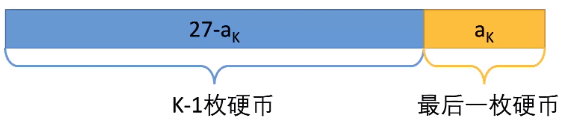
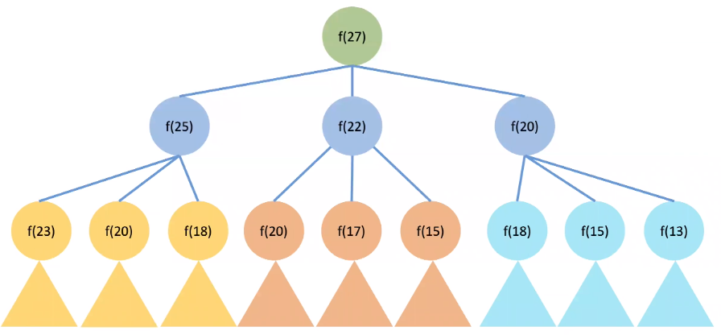
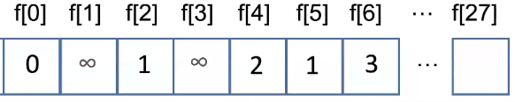
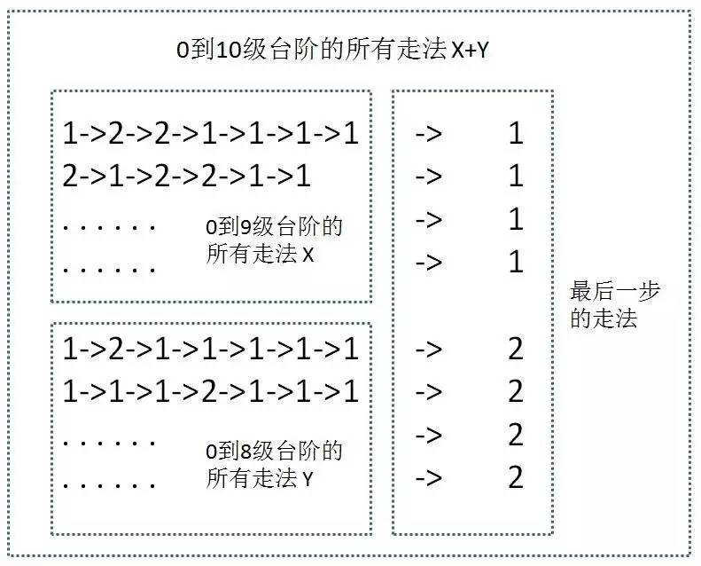
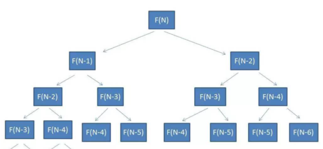
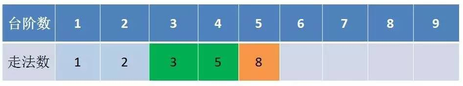

# 动态规划

## 导入
**例题**

使用任意数量的2，5，7元硬币凑出27元，最少需要多少枚？

贪心：尽量最大，7+7+7+2+2+2，共需6枚

正确答案：7+5+5+5+5，共需5枚。


## 动归思路


### 1. 考虑最后一步

1.1 最优策略肯定是n枚硬币，a1，a2...an，加起来为27.

1.2 考虑最后一步，一定有一枚硬币ak，除去他之后，和为27-ak.

1.3 27-ak也应该是使用最少的硬币完成的。




### 2. 构建子问题

2.1 最少用多少个硬币可以拼出27-ak

2.2 最少用多少个硬币可以拼出27-ak-a(k-1)

2.3 通过符号语言进行描述，定义，用最少数量的硬币拼出x为f(x)

2.4 由于最后一枚硬币只能是2，5，7，所以

f(27)=min{f(27-2)+1,f(27-5)+1，f(27-7)+1}

2.5 推广到一般形式

f(x)=min{f(x-2)+1,f(x-5)+1,f(x-7)+1}


### 3. 递归求解

```cpp
int f(int x)
{
    if(x==0) return 0;
    int result=666666;
    if(x>=2)
    {
        result=min(f(x-2)+1,result);
    }
    if(x>=5)
    {
        result=min(f(x-5)+1,result);
    }
    if(x>=7)
    {
        result=min(f(x-7)+1,result);
    }
    return result;
}

```
  


**重复计算，效率低下**

### 4.动态规划求解

4.1 确定状态转移方程

f[x]=min(f[x-2]+1,f[x-5]+1,f[x-7]+1)

4.2 初始条件

f[0]=0

4.3 边界条件(什么时候停下来）

因f(x)=用最少的硬币拼出x，故f(-1)是拼不出来的
定义当拼不出x时，f(x)=∞

例如，f(1)=min(f(-1)+1,f(-4)+1,f(-6)+1)=∞

故f(1)拼不出来。

4.4 计算步骤

设置数组 int f[100]保存所有的状态
设初值f[0]=0

使用转移方程计算f[1],f[2]。。f[27]

  

4.5 时间复杂度

与递归相比，没有重复计算

时间复杂度27*3，O(MN)

4.6 代码

```cpp
#include<iostream>
#include<vector>
using namespace std;

int main()
{
    vector<int> coins;
    int n;
    int i,j;
    cin>>n;
    int coin_temp;
    i=0;
    for(i=0;i<3;i++)
    {

        cin>>coin_temp;
        coins.push_back(coin_temp);
    }

    vector<int>::iterator iter;

    int f[100];
    f[0]=0;
    for(i=1;i<=n;i++)
    {
        f[i]=6666666;
        for(iter=coins.begin();iter!=coins.end();iter++)
        {
            if(i>=*iter && f[i-*iter]!=6666666)
            {
                f[i]=min(f[i-*iter]+1,f[i]);
    
            }
        }
        cout<<i<<":"<<f[i]<<endl;


    }


    cout<<endl;
    if(f[n]==6666666)
    {
        cout<<-1;
    }
    else
    {
        cout<<f[n];
    }
    
}
```


## 上楼梯

**题目**

有一座高度是10级台阶的楼梯，从下往上走，每跨一步只能向上1级或者2级台阶。要求用程序来求出一共有多少种走法。

1. 从最后一步推出状态转移方程

  

设状态F（X）表示，走到第X级台阶有几种走法。
F(10)=F(9)+F(8)
F(9)=F(8)+F(7)
F(x)=F(x-1)+F(x-2)

2. 初始值

显然F(1)=1,F(2)=1。

3. 递归


  

时间复杂度：O(2^N)

4. 动态规划

  


时间复杂度：O(N)


## 有毒气室的格子(2021第二次省赛python倒数第二题)

**题目**
有编号为1~100的房间，从1开始走格子，可以一次走一格或两个。走到M号格子截至。X和Y号的格子有毒气，不能停留。
给出M，X，Y，求出有几种走法。

##  数字三角形

https://www.luogu.com.cn/problem/P1216

**输入**

5

5

7

3 8

8 1 0

2 7 4 4

4 5 2 6 5 


**输出**

30

状态转移方程

f[x][y]=max(f[x+1][y],f[x+1][y+1])+a[x][y]

