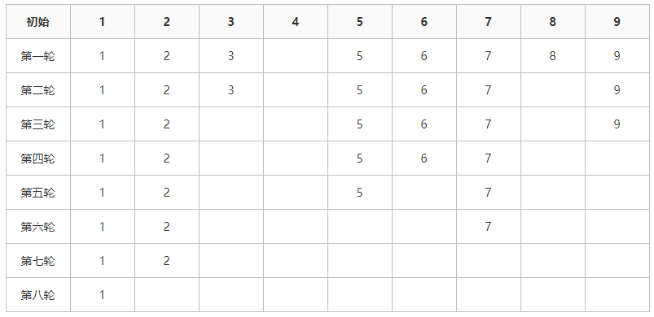
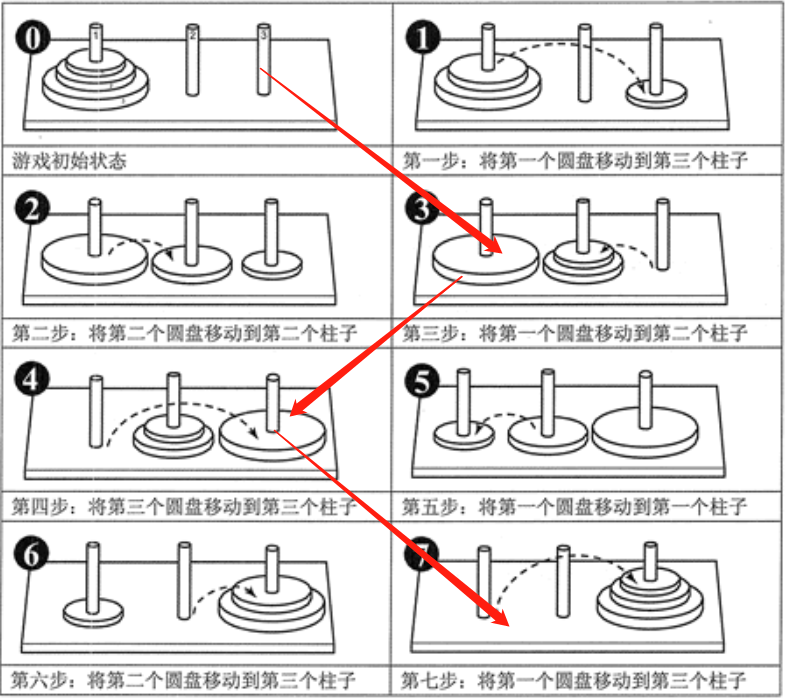
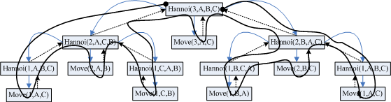
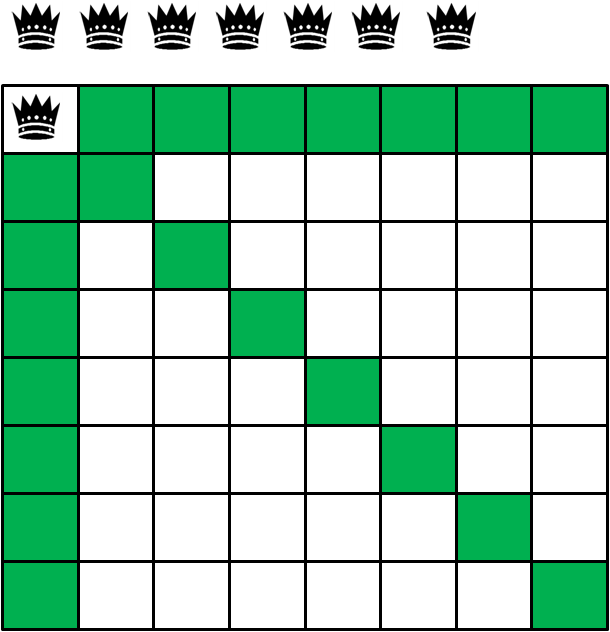
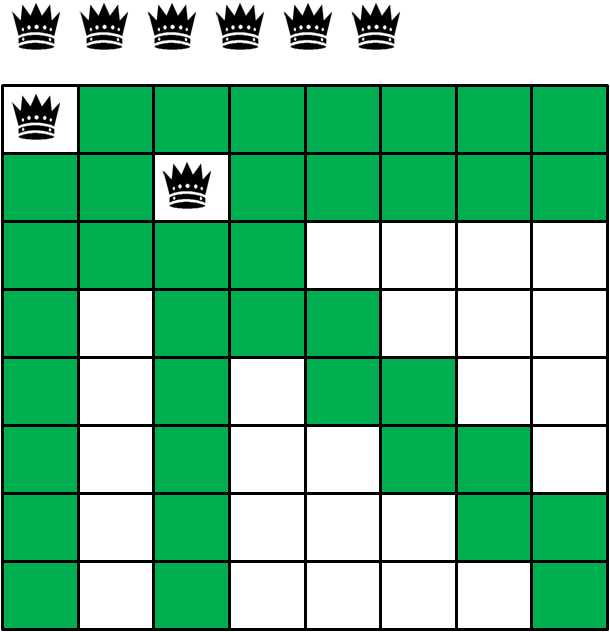
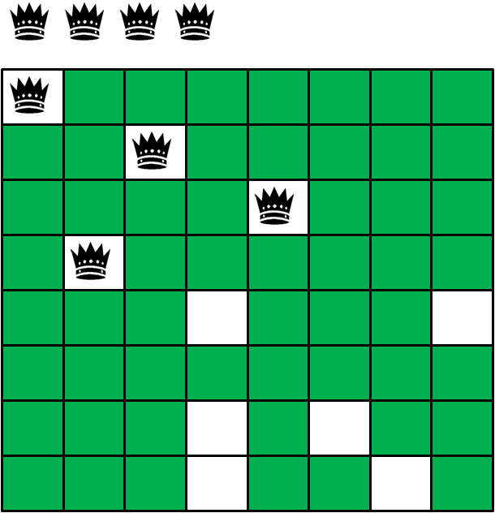
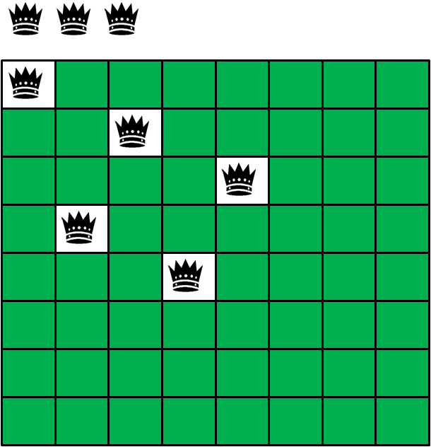
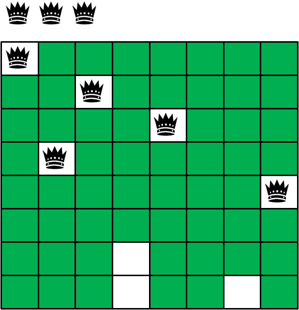
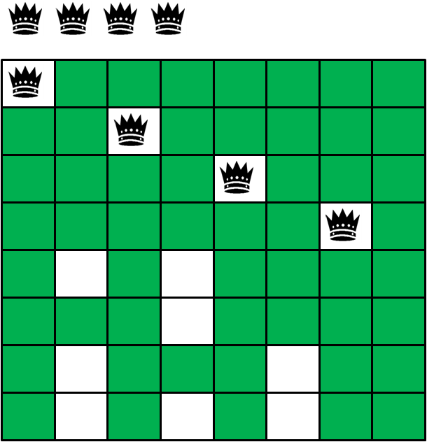
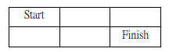

# 递推与递归

## 注意事项

递归的关键有两个：


（1）递归的结束条件（不写会死循环，TLE）

（2）递归最后一层和其他有关系的层的关系怎样用非递归函数来表达

**不要试图跟踪大型递归的过程！**

## Fibonacci数列的递归解法

```cpp
#include<iostream>
using namespace std;
int fibonacci_recursion(int n){
    if (n < 2) {
        return 1;
    }
    return fibonacci_recursion(n-1)+fibonacci_recursion(n-2);
}
int main() 
{
    for (int i=0; i<10; i++) 
	{
        cout<<fibonacci_recursion(i)<<" ";
    }
    return 0;
}
```


## 辗转相除法求最大公约数


辗转相除算法，又名欧几里德算法(Euclidean algorithm)，乃求两个正整数之最大公约数的算法。它是已知最古老的算法, 其可追溯至公元前300年。
若 a=bq+r,则a和b的最大公因子等于b和r的最大公因子绝对值（都为整数）。

即，f(a,b)=f(b,r),又，r=a%b,故，f(a,b)=f(b,a%b)

### 递推式

```cpp
int gcd(int m,int n)
{
    if(m<n) //m为最大的
    {
        int tmp=m;
        m=n;
        n=tmp;
    }
    if(n==0)
        return m; //除了0以外的所有自然数都是0的约数。
    while(n!=0)
    {
        int tmp=m%n;
        m=n;
        n=tmp;
    }
    return m;
}
```

### 递归式

```cpp
#include <iostream>
int gcd2(int m,int n)
{
    if(m<n)
    {
        int tmp=m;
        m=n;
        n=tmp;
    }
    if(n==0)
        return m;  //这个很关键
        
    else
        return gcd2(n,m%n);

}
int main()
{
	int a;
	a=gcd2(100,60);
	std::cout<<a;
}
```


### 约瑟夫环问题的递归解法

n个人围成一圈（编号从1到n），从第1个人开始报数，报到m的人出列，从下一个人再重新报数，报到m的人出列，如此下去，直至所有人都出列。求最后一个出列的人的编号。

  

解决约瑟夫环问题，我们采用倒推，我们倒推出：最后剩下的这个数字，在最开始的数组中的位置。

剩下最后一个数字（简称“它”）的时候，总个数为 1，它的位置 pos = 0。

那么它在上一轮也是安全的，总个数为 2，它的位置 pos = (0 + m) % 2；

那么它在上上轮也是安全的，总个数为 3，它的位置 pos = ((0 + m) % 2 + m) % 3；

那么它在上上上轮也是安全的，总个数为 4，它的位置 pos = (((0 + m) % 2 + m) % 3) % 4；


那么它在游戏开始的第一轮也是安全的，总个数为 n，它的位置 pos 就是最后的结果。
即如果从下向上反推的时候：假如它前一轮的索引为 pos，那么当前轮次的位置就是 (pos + m) % 当前轮次的人数。

#### 数学推导过程

定义函数 f(n, m) ：表示对 n 个数字 0, 1, …, n - 1 做约瑟夫环操作，最后剩下的这个数字。

在 0, 1, …, n - 1 这 n 个数字中，第一个被删除的数字是 (m - 1) % n。为了简单起见，我们把 (m - 1) % n 记为 k，那么删除 k 之后剩下的 n - 1 个数字为 0, 1, …, k - 1, k + 1, …, n - 1，并且下一次删除时要从 k + 1 开始计数。相当于在剩下的序列中， k + 1 排在最前面，所以第二次操作的序列是 k + 1, …, n - 1, 0, 1, …, k - 1。

在这个新序列上再完成约瑟夫环操作，最后剩下的数字应该是关于 n 和 m 的函数，即也可以用 f(n, m) 进行表示。但由于现在的这个序列的排列（从 k + 1 开始）和最初的序列（从 0 开始）不一样，因此这个时候的函数已经不同于最初的函数，记为 h(n - 1, m)，此函数的定义：在 k + 1, …, n - 1, 0, 1, …, k - 1 这 n - 1个数字的序列上做约瑟夫环操作后，**最后剩下的这个数字**。


由于 在最初序列上 和 在新序列上 完成约瑟夫操作剩下的数字均为同一个数字，所以有 f(n, m) = h(n - 1, m)。（新序列是从最初序列转化的，会最终转化到同一个数字）

下面的工作就是求解新函数 h(n - 1, m) ，使其能够用 f(n - 1, m) 表示出来。

由于 f(n - 1, m) 是定义在以 0 为开始的序列上的，所以我们把剩下的这 n - 1 个数字的序列 k + 1, …, n - 1, 0, 1, …, k - 1 进行映射，映射到结果是形成一个 0 ~ n - 2 的序列。

该映射函数是个一元一次函数，定义为 p(x)，则 p(x) = (x + n - k - 1) % n。

从左到右的映射是 p(x)，从右到左的映射叫做逆映射 p-1(x) = (x + k + 1) % n。

由于映射之后的序列和最初的序列有同样的形式，即都是从 0 开始的连续序列，因此在映射之后的序列上做约瑟夫环操作的结果仍可以用函数 f 表示，记为 f(n - 1, m)。

在映射之前的序列上的约瑟夫环操作的结果是 h(n - 1, m)，在映射之后的序列上的约瑟夫环操作的结果是 f(n - 1, m)，则 f(n - 1, m) = p( h(n - 1, m) )。

所以有

$h(n-1,m)=p^{-1}(f(n-1),m))=[f(n-1,m)+k+1]\%n$

```cpp

#include <iostream>
using namespace std;
int josephus(int n, int m) 
{
	if(n == 1) return 0;
	else return ( josephus(n-1,m)+m ) % n;
}
 
int main() 
{
	int n, m;
	cin >> n >> m;
	int result = josephus(n, m);
	cout << result+1 << endl;
}
```

**迭代实现**

```cpp
#include <stdio.h>
/*计算约瑟夫环问题的迭代法函数*/
#include <stdio.h>
int main() {
	int n, m, i, result;
	while (scanf("%d", &n) == 1) {
		if (!n) {
			break;
		}
		scanf("%d", &m);
		result = 0;
		for (i = 2; i <= n; i++) {
			result = (result + m) % i;
		}
		printf("%d\n", result + 1);
	}
	return 0;
}
```

### 汉诺塔

  

注意：在第三步，可以视作开始了一个新的游戏，并把中间的柱子视作A，将旧的ABC映射为新的CAB。


```cpp
#include <iostream>
#include <cstdio>
using namespace std;
 
int cnt;
 
void move(int id, char from, char to) // 打印移动方式：编号，从哪个盘子移动到哪个盘子
{
    printf ("step %d: move %d from %c->%c\n", ++cnt, id, from, to);
}
 
void hanoi(int n, char x, char y, char z)
{
    if (n == 0)
        return;
    hanoi(n - 1, x, z, y);
    move(n, x, z);
    hanoi(n - 1, y, x, z);
}
 
int main()
{
    int n;
    cnt = 0;
    scanf ("%d", &n);
    hanoi(n, 'A', 'B', 'C');
    return 0;
}
```
   

### 八皇后

**题目**

国际象棋中的皇后，可以横向、纵向、斜向移动。如何在一个8X8的棋盘上放置8个皇后，使得任意两个皇后都不在同一条横线、竖线、斜线方向上？八皇后问题是一个古老的问题，于1848年由一位国际象棋棋手提出：在8×8格的国际象棋上摆放八个皇后，使其不能互相攻击，即任意两个皇后都不能处于同一行、同一列或同一斜线上，如何求解？

**图解**

尝试在第一行摆放第一个皇后：

  

尝试在第二行摆放第二个皇后（前两格被第一个皇后封锁，只能落在第三格）：

  

尝试在第三行摆放第三个皇后（前四格被第一第二个皇后封锁，只能落在第五格）：

  

尝试在第四行摆放第四个皇后（第一格被第二个皇后封锁，只能落在第二格）：

  

尝试在第五行摆放第五个皇后（前三格被前面的皇后封锁，只能落在第四格）：

  


由于所有格子都“绿了”，第六行已经没办法摆放皇后，于是进行回溯，重新摆放第五个皇后到第八格：

  

第六行仍然没有办法摆放皇后，第五行也已经尝试遍了，于是回溯到第四行，重新摆放第四个皇后到第七格。：

  


```cpp
#include<stdio.h>
#define line 8
int count = 0;//计算总的放法
int Map[8][8];//方格位置 
void Search(int x,int y);//寻找方案函数
int Check(int x,int y);//检查函数检查该位置是否能放 
void printResult();

int main()
{
	int i = 0,j = 0;
	for(i = 0;i <= 8;i++)
		for(j = 0;j <= 8;j++)
			Map[i][j] = 0;
	Search(0,0);
	printf("%d",count);
	return 0; 
}

void Search(int row,int col)
{
	if( col >= line)
		return ;
	if(Check(row,col))
	{
		Map[row][col] = 1;
		if(row == line -1)//如果是最后一行
			count++;
            printResult();
		else//不是最后一行时，继续往下一行进行递归判定
			Search(row+1,0);
	}
	Map[row][col] = 0;//该位置不符合要求存在，赋值为零
	Search(row, col+1);//讨论旁边位置 
}

int Check(int row,int col)
{
	int i = 0,m = 0, n = 0,prerow = row,precol = col;
	for(i = 0;i <= line-1;i++)//横向检查 
		if(Map[i][col] == 1)	return 0;
	for(i = 0; i <= line - 1;i++)//纵向检查 
		if(Map[row][i] == 1)	return 0;		
		
	m = row >= col ? col : row ;
	row = row - m,col = col - m;
	while(row <= line -1 && col <= line -1) //由左上到右下的对角线判断 
	{
		if(Map[row][col] == 1 && row != prerow && col != precol)
			return 0;
		row++,col++;
	}
	
	row = prerow,col = precol;
	n = row >= (line - 1 - col) ? (line - 1 - col) : row ;
	row = row - n,col = col + n; 
	while(row <= line -1 && col >= 0) //由右上到左下的对角线判断 
	{
		if(Map[row][col] == 1 && row != prerow && col != precol)
			return 0;
		row++,col--;
	}
	return 1;
}
```

### 方格走法

【编程实现】

查找路径。
有一张 m×n 个小方格的地图，一个机器人位于地图的左上角（如图标记为
Start 的地方），它每步只能向右或者向下移动一格，如果走到右下角的终点
（如图标记为 Finish 的地方），有多少种不同的方法？

  


例如，一个 3×2 的地图，行走的方法数是 3 种，分别是：
1. 右 -> 右 -> 下
2. 右 -> 下 -> 右
3. 下 -> 右 -> 右

输入描述：

两个整数 m(m<=100)和 n(n<=100)，代表地图的行数和列数。
输出描述：
一个整数，表示行走的方法数。

【样例输入】

8 8

【样例输出】

3432


分析：

1.当n == 2或 m == 2时，共有n+m种走法（不为1的加1种）；

2.当n、m都大于1时，那么最终走到右下角只有两条路径：

（1）从[n-1, m]到右下角；

（2）从[n, m-1]到右下角。

假设从左上角走到[n, m]位置有f(n, m)种走法，则：n*m的棋盘从左上角到右下角共有f(n-1, m) + f(n, m-1)种走法。

因此，我们可以使用递归解决上述问题，退出条件为1.

```cpp
#include <iostream>
using namespace std;

int get(int x, int y) 
{
	if (x == 1) return y + 1;
	if (y == 1) return x + 1;
	return get(x - 1, y) + get(x, y - 1);
}

int main()
{
	int x, y;
	cin >> x >> y;
	cout << get(x-1, y-1) << endl;
    system("pause");
    return 0;
}
```

